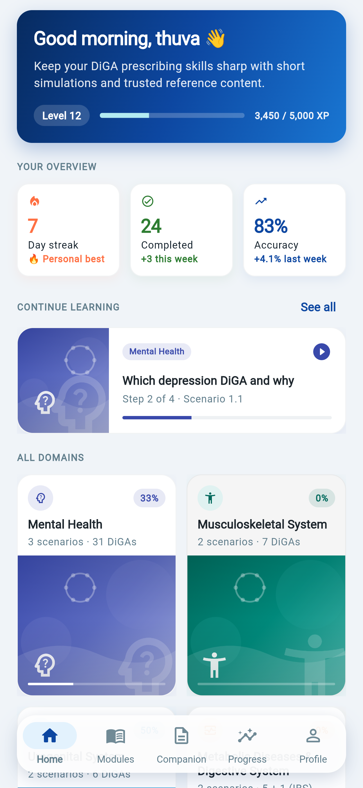
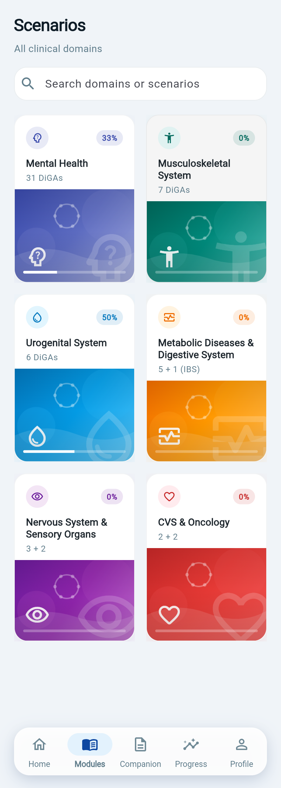
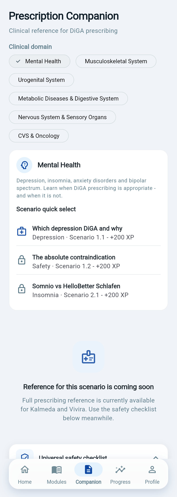
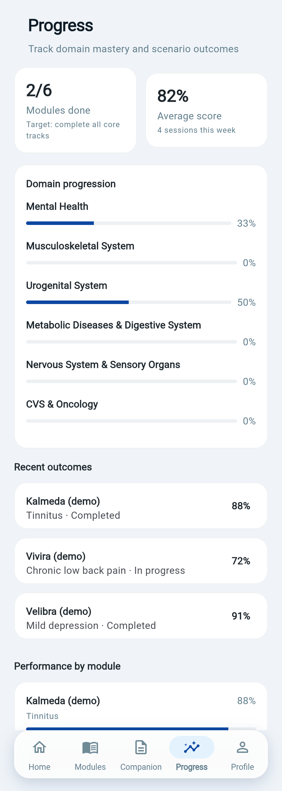
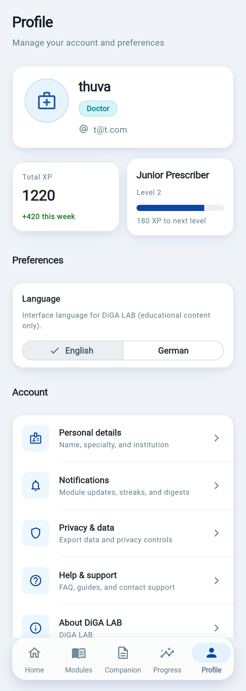
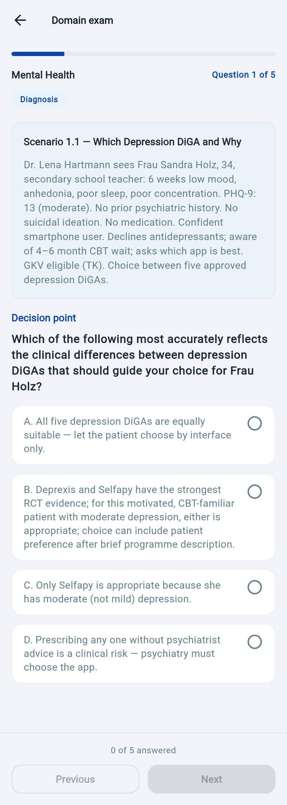
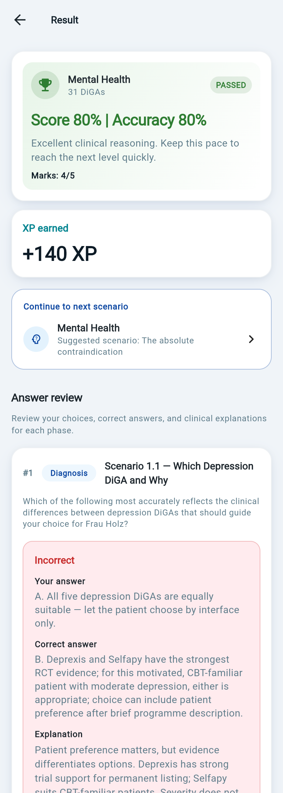
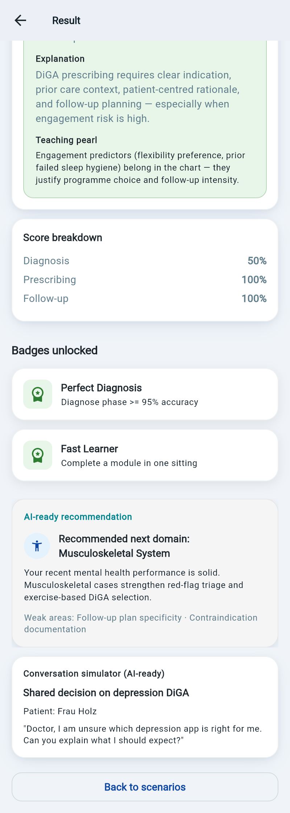

# DH Programming Report — DiGA LAB Prototype

**Course:** Digital Health Programming  
**Prototype:** DiGA LAB — Educational DiGA Prescribing Simulation  
**Author:** Ponraj Thuvarakan  
**Responsible:** Prof. Christian Roth  
**Institution:** Deggendorf Institute of Technology, European Campus Rottal-Inn  
**Date:** 16 July 2026  
**Repository:** <https://github.com/Thuvarakan-97/diga>  
**Live demo:** <https://diga-411dd.web.app>  
**Firebase project:** `diga-411dd`

---

## 1. Prototype Description

### 1.1 Purpose and target users

DiGA LAB is an educational application that helps medical students and physicians practise the main steps involved in prescribing Digital Health Applications (DiGAs) in Germany. The prototype presents clinical learning scenarios in different medical domains and guides the learner through diagnosis, prescription and follow-up questions.

The application is intended only for education and training. It is not a clinical decision-support system and must not be used to prescribe a DiGA for a real patient. Its purpose is to provide a safe environment in which learners can practise, make mistakes and review explanations.

The current prototype includes the following functions:

- email/password and Google authentication with Firebase;
- six clinical domains: Mental Health, Musculoskeletal, Urology, Metabolic, Neurology and Cardiovascular;
- short multiple-choice examinations with diagnosis, prescription and follow-up phases;
- score calculation and review of correct and incorrect answers;
- scenario progression and unlocking;
- a rule-based personalised learning report created after an examination;
- a Prescription Companion with reference checklists;
- English and German localisation;
- web deployment through Firebase Hosting;
- Android APK generation through GitHub Actions.

Some gamification information, such as XP, badges, levels and streaks, is currently supported by mock or Firebase-ready logic. A live large language model is not connected to the running prototype.

**Figure 1.** Home dashboard with learning overview, continue-learning card and clinical domain list.



**Figure 2.** Modules screen listing all clinical domains with progress indicators.



### 1.2 Technical architecture

The application was developed with Flutter and Dart so that one source code base can support web and Android platforms. Riverpod manages application state, while `go_router` handles navigation and route protection. Firebase provides authentication, user profile storage, analytics configuration and web hosting.

| Layer | Technology | Main purpose |
|---|---|---|
| User interface | Flutter / Dart | Cross-platform screens and application logic |
| State management | Riverpod | Authentication, quiz, progress and report state |
| Navigation | `go_router` | Login guards, tabs, examination and result routes |
| Cloud services | Firebase | Authentication, Firestore and Hosting |
| Current report logic | Local rule and template engine | Produces feedback from quiz results |
| Future AI service | Gemini API | Optional richer feedback at scale |
| Delivery | GitHub Actions | Automated Android APK build |

The project is organised under `lib/features/`, including folders for authentication, simulation, companion, gamification, progress, profile and AI support. This separation made it easier to work on one feature without changing unrelated parts of the application.

### 1.3 My Specific Contribution

I was responsible for designing, developing, testing and integrating the main components of the DiGA LAB prototype.

My work included defining the educational purpose of the application, selecting the clinical domain structure and designing the examination flow. I implemented and improved Firebase authentication for web and Android, including email/password login, Google Sign-In and the creation of a basic Firestore user profile.

I developed the examination workflow, question loading, score calculation, result review and scenario progression. I also worked on the English and German question content and connected the selected language to the examination screens.

Another major part of my contribution was the user interface. I redesigned the login page, home dashboard, domain cards, examination screens and result page. I added visual feedback for passing an examination and improved the layout so that it worked correctly in Chrome and on smaller screens.

The current personalised learning report was also part of my work. It is not generated by Gemini or OpenAI. It uses the learner's incorrect answers, stored explanations, weak examination phases and predefined templates to create targeted feedback. I designed it this way so that the prototype could provide useful guidance without sending learning data to an external AI service.

Finally, I configured Firebase Hosting, Firestore rules and the GitHub Actions workflow used to build an Android APK. I tested the web version, corrected runtime and layout errors and deployed the current live demonstration.

**Figure 3.** Prescription Companion with domain selection and scenario quick links.



**Figure 4.** Progress screen showing domain progression and recent outcomes. Some metrics in this view still use demo values.



**Figure 5.** Profile screen with XP summary, English/German language switch and account settings.



**Figure 6.** Domain examination screen with clinical vignette, diagnosis phase and multiple-choice options.



**Figure 7.** Result screen with score summary and answer review, including incorrect answers and clinical explanations.



**Figure 8.** Result feedback area with phase score breakdown, recommendation card and conversation-scenario card. The recommendation content is currently template-based; no live Gemini or OpenAI API is called.



> **Submission note:** The source-code ZIP must include all eight image files under `assets/images/` using the same filenames shown in this report; otherwise, the Markdown image links will be broken.

---

## 2. Lessons Learned

### 2.1 Tools used

The main development tools were Flutter, Dart, Firebase Console, Firebase CLI, Git, GitHub, Chrome and PowerShell. I used Cursor as an AI-assisted development environment. It supported code suggestions, debugging, refactoring and documentation. However, I reviewed, tested, corrected and integrated the final code myself.

No paid AI API is used by the running application. Cursor was used during development, while the application's current learning report is generated locally through deterministic rules.

### 2.2 Technical lessons

One important problem occurred during Firebase initialisation on Flutter Web. When the application ran in Chrome on Windows, platform detection could return Windows before the web condition was checked. This caused the Firebase web configuration to be skipped. I solved the issue by checking `kIsWeb` before evaluating the operating-system platform.

I also learned that Firebase Authentication and Firebase Hosting are separate services. Adding an authorised domain allows authentication redirects, but it does not deploy the website. The web build still has to be created and uploaded with the Firebase CLI.

Riverpod state management created another challenge. An `autoDispose` quiz provider removed answers when the user moved to the result page. I added a result cache so that the selected answers and explanations remained available for review.

During web testing, some buttons were placed inside rows without suitable width constraints. This caused overflow and hit-testing errors. Moving the controls into constrained widgets and using `Expanded` solved the problem.

My computer did not have enough resources for a complete Android Studio environment. GitHub Actions became a practical solution because it could install the required Android toolchain and produce the release APK in the cloud.

The project also showed me that useful educational feedback does not always require a live LLM. Carefully written explanations and rule-based selection can provide predictable feedback with no token cost and less privacy risk. A cloud AI model is more suitable as an optional future feature rather than a requirement for the first prototype.

---

## 3. README: Artifacts, Setup and Execution

### 3.1 Main artifacts

| Artifact | Location | Purpose |
|---|---|---|
| Flutter source code | `lib/`, `android/`, `web/` | Application code and platform configuration |
| Package configuration | `pubspec.yaml` | Dependencies and assets |
| Prototype screenshots | `assets/images/` | UI figures used in this report (Figures 1–8) |
| Firebase configuration | `lib/firebase_options.dart` | Firebase options for supported platforms |
| Android Firebase file | `android/app/google-services.json` | Android Firebase connection |
| Firestore rules | `firestore.rules` | User-data access control |
| Hosting configuration | `firebase.json`, `.firebaserc` | Firebase Hosting deployment |
| Localisation files | `lib/l10n/app_en.arb`, `app_de.arb` | English and German strings |
| APK workflow | `.github/workflows/build-apk.yml` | Automated Android build |

Private service-account files and secret API keys must not be added to the repository. A future Gemini key should be stored in a server-side secret manager rather than directly in the Flutter application.

### 3.2 Required software

- Flutter stable and Dart;
- Git;
- Chrome or Edge for web testing;
- Node.js and npm for Firebase CLI;
- access to the Firebase project or a separately configured Firebase project;
- Android Studio, Android SDK and Java 17 for a local Android build, or GitHub Actions as an alternative.

The environment can be checked with:

```bash
flutter doctor
```

### 3.3 Installation

```bash
git clone https://github.com/Thuvarakan-97/diga.git
cd diga
flutter pub get
```

A developer using a different Firebase project must enable Email/Password authentication, optionally enable Google Sign-In, create a Firestore database, register the web and Android applications and replace the Firebase configuration files.

### 3.4 Run the prototype

Run the web version:

```bash
flutter run -d chrome
```

Run on a connected Android device or emulator:

```bash
flutter run -d android
```

Build the Flutter web release and deploy it:

```bash
flutter build web --release
firebase login
firebase deploy --only hosting
```

Build an Android APK locally:

```bash
flutter build apk --release
```

The local output is normally created at:

```text
build/app/outputs/flutter-apk/app-release.apk
```

The APK can also be created through the **Build Android APK** workflow in GitHub Actions. After the workflow completes, the APK is available as a downloadable workflow artifact.

### 3.5 Basic test flow

1. Register or sign in.
2. Select a clinical domain and scenario.
3. Complete the examination.
4. Review the score, answers and personalised learning report.
5. Confirm that the next scenario is unlocked.
6. Sign out from the profile page.

---

## 4. Technological Go-to-Market and Scale-up Plan

### 4.1 Initial market approach

The first target group is medical students and physicians in training who need a practical introduction to DiGA prescribing. The prototype could first be tested within one university module. Feedback from learners and lecturers would be used to improve the scenarios, explanations and difficulty.

After a successful pilot, DiGA LAB could be offered to universities, medical training organisations and continuing medical education providers. A possible payment model is a free learner version with a limited number of scenarios and an institutional licence for complete modules, cohort reporting and administrative functions.

A future commercial version would continue to be described clearly as an educational product. Medical content would require review by qualified professionals, and real patient data should not be entered into the training system.

### 4.2 Planned cloud architecture

Firebase Authentication, Firestore and Hosting are suitable for the first stages because they are already connected to the prototype and use a pay-as-you-go model after their free allowances. Cloud Functions could later be added as a secure server-side layer for AI requests. This would prevent an AI API key from being exposed in the Flutter client and would allow rate limits to be applied per user.

For optional AI-generated coaching, the proposed model is `gemini-3.1-flash-lite`. It is intended for high-volume, lower-cost text processing. The current application would still keep the rule-based report as the default option, while paid or institutional users could receive extended AI feedback.

### 4.3 Expected usage

The following calculation uses an early-product scenario of **1,000 monthly active learners**.

| Activity | Assumption per learner/month | Total per month |
|---|---:|---:|
| Sessions | 12 | 12,000 |
| Completed examinations | 8 | 8,000 |
| Firestore document reads | 120 | 120,000 |
| Firestore document writes | 30 | 30,000 |
| Maximum stored user data | 1 MB | Approximately 1 GB |
| Optional AI reports | 8 | 8,000 |

The average Firestore activity is approximately 4,000 reads and 1,000 writes per day when divided across 30 days. Firebase currently provides a Firestore free allowance of 50,000 document reads per day, 20,000 document writes per day, 20,000 document deletes per day, 1 GiB of stored data and 10 GiB of monthly outbound transfer for one database. The estimated reads and writes are therefore inside the free allowance. Storage is close to the 1 GiB limit only when the deliberately conservative maximum of 1 MB per learner is reached.

On the Firebase Spark plan, Authentication supports up to 3,000 daily active users for email and social sign-in providers. On the Blaze plan, pricing is based on monthly active users and includes a no-cost allowance of up to 50,000 monthly active users. Therefore, the estimated 1,000 monthly active learners remain within the relevant no-cost limits.

Firebase Hosting includes 10 GB of stored content and 10 GB of monthly data transfer at no cost. The Flutter web build is expected to require much less than 10 GB of storage. Bandwidth depends on the final build size and browser caching. For example, if a first visit transfers 5 MB, 1,000 learners making two uncached full loads would use about 10 GB:

```text
1,000 learners × 2 loads × 5 MB = 10,000 MB ≈ 10 GB
```

Additional Hosting storage on the Blaze plan is listed at **$0.026 per GB**, and transfer above the monthly free allowance is **$0.15 per GB**.

### 4.4 Planned Gemini cost

Pricing checked in July 2026 for `gemini-3.1-flash-lite` lists standard paid rates of:

- **$0.25 per 1 million input tokens** for text;
- **$1.50 per 1 million output tokens**, including thinking tokens.

For planning, one extended report is estimated to use 2,000 input tokens and 1,500 output tokens.

```text
Input cost per report:
2,000 / 1,000,000 × $0.25 = $0.0005

Output cost per report:
1,500 / 1,000,000 × $1.50 = $0.00225

Total cost per report:
$0.0005 + $0.00225 = $0.00275
```

For 1,000 learners receiving eight reports each:

```text
1,000 × 8 = 8,000 reports
8,000 × $0.00275 = $22.00 per month
```

For 10,000 monthly active learners:

```text
10,000 × 8 = 80,000 reports
80,000 × $0.00275 = $220.00 per month
```

These calculations cover only model tokens. They do not include tax, exchange-rate changes, server execution, monitoring, customer support or medical content review. The free Gemini tier may be useful for development and testing, but the commercial cost plan uses paid rates so that the estimate does not depend on free-tier availability.

### 4.5 Scale-up stages and payment model

| Stage | Users | Technical approach | Expected direct cloud/AI cost |
|---|---:|---|---|
| University pilot | 50 | Firebase free allowances, rule-based reports | Near €0 |
| Early product | 1,000 | Firebase plus optional Gemini coaching | About $22 AI, plus any bandwidth overage |
| Regional use | 10,000 | Cloud Functions, monitoring and Gemini | About $220 AI, plus cloud usage |
| Institutional product | Larger cohorts | Dedicated administration, audit logging and support | Usage-based quotation |

Possible commercial tiers are:

- **Free learner:** limited scenarios and rule-based feedback;
- **Pro learner:** all scenarios and a controlled AI-report allowance;
- **University or clinic:** licence per learner or per cohort, with an administration dashboard;
- **White-label deployment:** separate Firebase or Google Cloud project and customised content.

The main business cost is unlikely to be database operations. Medical content development, professional review, data-protection work and user support will probably cost more than Firestore reads or AI tokens.

---

## 5. Conclusion

DiGA LAB demonstrates a working educational prototype built with Flutter and Firebase. It combines bilingual clinical scenarios, authentication, examination progression, result review and personalised rule-based feedback. The project also provided practical experience with Flutter Web, Firebase configuration, Riverpod state management, responsive layouts, deployment and continuous integration.

The current version keeps external AI out of the runtime, which reduces cost and privacy risk. A Gemini-based report can be introduced later as an optional scale-up feature with a measurable token budget. Under the stated assumptions, a 1,000-user pilot remains within the main Firebase free allowances, while eight Gemini reports per learner would cost approximately $22 per month at the prices checked in July 2026.

---

## 6. References

1. Firebase. [Firebase Pricing](https://firebase.google.com/pricing). Accessed July 2026.
2. Firebase. [Cloud Firestore Pricing](https://firebase.google.com/docs/firestore/pricing). Accessed July 2026.
3. Firebase. [Cloud Firestore Quotas and Limits](https://firebase.google.com/docs/firestore/enterprise/quotas-native-mode). Accessed July 2026.
4. Firebase. [Firebase Authentication](https://firebase.google.com/docs/auth). Accessed July 2026.
5. Firebase. [Firebase Hosting Usage, Quotas and Pricing](https://firebase.google.com/docs/hosting/usage-quotas-pricing). Accessed July 2026.
6. Google AI for Developers. [Gemini Developer API Pricing](https://ai.google.dev/gemini-api/docs/pricing). Accessed July 2026.
7. Flutter. [Flutter Documentation](https://docs.flutter.dev/). Accessed July 2026.
8. GitHub. [GitHub Actions Documentation](https://docs.github.com/en/actions). Accessed July 2026.

---

*End of report.*
